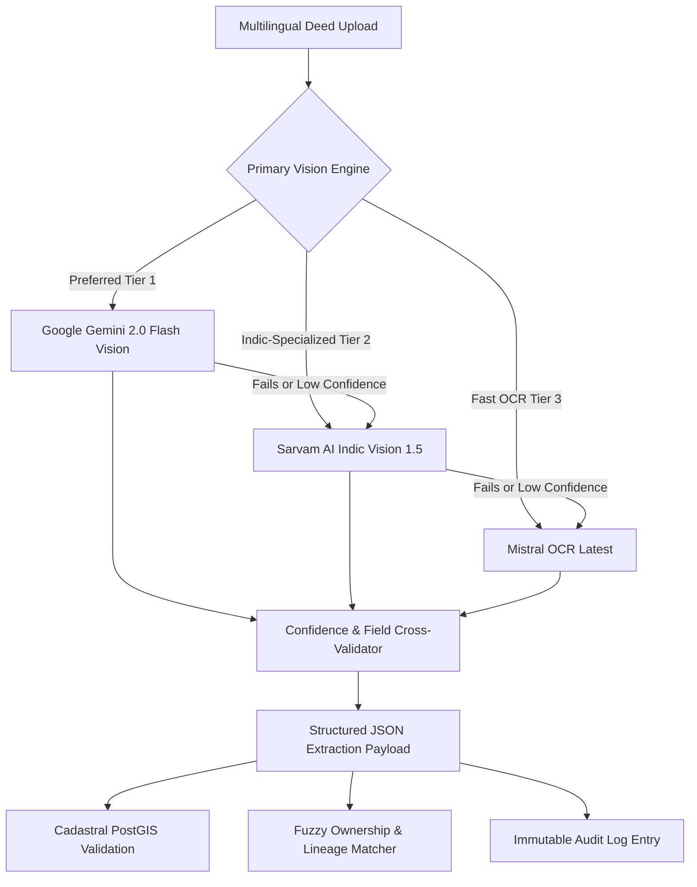
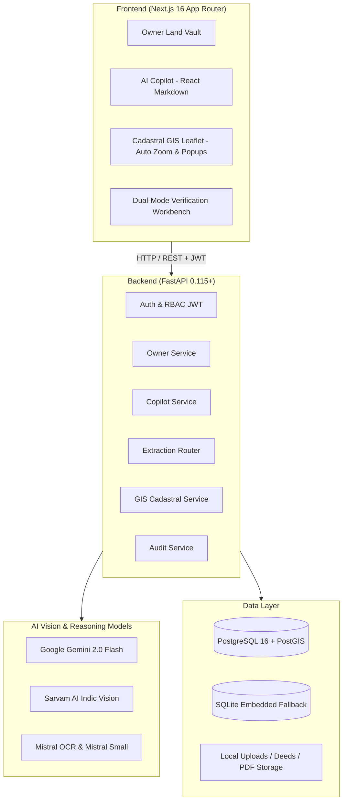

<div align="center">

# 🏛️ Land AI (इंडी-भूमि)

### **Next-Generation Land Record Intelligence, Indic Document AI, Owner Land Vault & Cadastral GIS Platform**

[](https://fastapi.tiangolo.com)
[](https://nextjs.org)
[](https://postgis.net)
[](https://www.sarvam.ai)
[](https://mistral.ai)
[](https://ai.google.dev)
[](https://github.com/remarkjs/react-markdown)
[](https://leafletjs.com)

*Transforming complex, multilingual Indian land revenue records into tamper-evident, spatially verified digital cadastral intelligence and an empowered Citizen Land Vault.*

[👤 Owner Land Vault](http://localhost:3000/owner) • [🤖 Land AI Copilot](http://localhost:3000/copilot) • [📊 Executive Dashboard](http://localhost:3000/dashboard) • [🗺️ Cadastral Satellite GIS](http://localhost:3000/gis) • [✍️ Verification Workbench](http://localhost:3000/verification) • [📑 Swagger API Docs](http://localhost:8000/api/v1/docs)

</div>

---

## 📖 Table of Contents

- [The Problem & Domain Context](#-the-problem--domain-context)
- [Comprehensive Feature Matrix](#-comprehensive-feature-matrix)
- [Two Primary User Experiences](#-two-primary-user-experiences)
  - [1. 👤 Land Owner Experience (Owner Land Vault)](#1--land-owner-experience-owner-land-vault)
  - [2. 🏛️ Government & Revenue Officer Portal](#2-️-government--revenue-officer-portal)
- [🤖 Land AI Copilot (Database-Grounded Mistral Chatbot)](#-land-ai-copilot-database-grounded-mistral-chatbot)
- [📜 Authentic Scanned Indian Deeds Repository (10 Nishu Documents)](#-authentic-scanned-indian-deeds-repository-10-nishu-documents)
- [Multi-Model Indic AI Extraction Pipeline](#-multi-model-indic-ai-extraction-pipeline)
- [Live Satellite Cadastral GIS Explorer](#-live-satellite-cadastral-gis-explorer)
- [Human-in-the-Loop Active Learning Workbench](#-human-in-the-loop-active-learning-workbench)
- [Role-Based Access Control (RBAC) & Security](#-role-based-access-control-rbac--security)
- [System Architecture](#-system-architecture)
- [API Endpoints Reference](#-api-endpoints-reference)
- [Quickstart: Run Locally in 3 Steps](#-quickstart-run-locally-in-3-steps)
- [Automated Testing Suite](#-automated-testing-suite)
- [Frontend Route Directory](#-frontend-route-directory)

---

## 🚨 The Problem & Domain Context

In India today, **over 66% of all civil litigation** is tied to land and property ownership disputes. This single issue locks up more than **$200 Billion** in stalled infrastructure, delayed housing projects, and contested agricultural mortgages.

### The Core Challenges:
1. **Multilingual, Degraded Paper Extracts**: Historical revenue deeds (**7/12 Satbara in Maharashtra, RTC Pahani in Karnataka, Vikraya Dastaaveju in Andhra Pradesh, Dharani Passbook in Telangana, Patta Chitta in Tamil Nadu, Jamabandi in Punjab/Haryana, Khasra Khatauni in UP**) are handwritten or poorly printed across dozens of regional Indic scripts.
2. **Generic OCR Failures**: Mainstream Western OCR engines fail to parse Indic tabular structures, Devanagari numerals (१, २, ३...), and regional revenue terminology (*Hissa, Pot-Kharaba, Khatadar, Rayathwari, Khushki/Dry vs. Bagayat/Wet Extents*).
3. **Deed vs. Physical Ground Discrepancies**: Written deeds frequently claim land areas that contradict actual surveyed physical cadastral polygons.
4. **Fraudulent Mutations & Broken Succession Chains**: Lack of fuzzy phonetic matching enables duplicate title sales and unverified mutation entries.
5. **Citizen Disempowerment**: Land owners struggle to get a single unified view of their multi-state land holdings, mutation records, and boundary conflicts.

---

## 🌟 Comprehensive Feature Matrix

| Feature Module | Core Capabilities | Route / Location |
| :--- | :--- | :--- |
| **👤 Owner Land Vault** | Complete personal land portfolio answering *"What land do I own?"* with deterministic totals (Acres/Ha), state breakdowns, verified vs attention metrics. | `/owner` |
| **📑 My Land (Properties)** | Filterable & searchable card grid of all owned properties with live discrepancy indicators and quick links to deep inspector. | `/owner/properties` |
| **🔍 Property Deep Inspector** | Side-by-side deed evidence preview, original scanned image view, PostGIS WGS-84 satellite extent comparison, and chronological history with light theme harmonization. | `/owner/properties/[id]` |
| **📜 Document Repository** | Visual repository of **10 authentic scanned Indic land deeds** with high-resolution thumbnail cards and modal image zoom. | `/owner/documents` |
| **⏳ Land History Ledger** | Chronological title lineage tracking inheritance successions, purchase registrations, and government allotments. | `/owner/history` |
| **🗺️ Personal Cadastral GIS** | Dedicated satellite map with auto-zoom (`flyToBounds`), interactive popups, document redirection, custom scrollbar, and interactive pagination. | `/owner/gis` |
| **🤖 Land AI Copilot** | Zero-hallucination conversational intelligence grounded strictly in DB evidence; powered by Mistral reasoning and rich **React Markdown tables**. | `/copilot` |
| **🔐 Strict RBAC & Route Guards** | Institutional login with 1-click Demo accounts and strict route guards preventing citizen access to government administration pages. | `/login`, `/signup` |
| **👁️ Indic Vision OCR** | Multilingual vision extraction pipeline orchestrating **Google Gemini 2.0 Flash**, **Sarvam AI Vision 1.5**, and **Mistral OCR**. | `/upload` |
| **⚖️ Cadastral Conflict Engine** | Automated geometric polygon calculation comparing physical satellite area against legal deed area with $>5\%$ mismatch warnings. | `/gis` |
| **✍️ Dual-Mode Active Learning Workbench** | Side-by-side human review tool with toggles for high-res original scanned photo (zoom/rotate) and digital Village Form VII/XII extract with active learning editors. | `/verification/[id]` |
| **📊 Executive Intelligence** | Multi-state revenue health metrics, risk analysis, lineage graph visualizations, and verification queues. | `/dashboard`, `/intelligence` |
| **🛡️ Tamper-Evident Audit Trail** | SHA-256 verified, JSON-diffed audit log recording every mutation, extraction, review, and verification action. | `/audit` |

---

## 👥 Two Primary User Experiences

### 1. 👤 Land Owner Experience (Owner Land Vault)
Designed specifically for Indian land owners and citizens to monitor, protect, and understand their multi-state land holdings without bureaucratic friction.

```
Citizen Login (/login) 
  → Owner Dashboard (/owner)
  → My Land Portfolio (/owner/properties)
  → Deep Property Inspector (/owner/properties/[id])
  → Document Repository (/owner/documents)
  → Ownership History Timeline (/owner/history)
  → Satellite Cadastral Map with Pagination & Auto-Zoom (/owner/gis)
  → Land AI Copilot (/copilot)
```

- **Deterministic Portfolio Overview**: Total acreage in both Acres and Hectares, total properties count, state distribution, and verified vs attention breakdown.
- **Strict Read-Only Citizen Mode**: Citizens can track and search their properties; upload/ingestion and government command routes are strictly guarded.
- **Interactive Cadastral GIS**: Select any land parcel to auto-zoom on the satellite map, or click the polygon to open direct deed verification details. Includes real-time search, smooth scrollbar, and pagination.
- **Document Previews**: Direct high-resolution visual inspection of original scanned deeds (*RTC Pahani, Dharani Passbook, Satbara 7/12, Patta Chitta*).

---

### 2. 🏛️ Government & Revenue Officer Portal
Designed for Tehsildars, Sub-Registrars, Revenue Inspectors, and Surveyors to process deed uploads, verify cadastral boundaries, and resolve title conflicts.

```
Officer Login (/login)
  → Government Command Center (/dashboard)
  → Document Upload & Ingestion (/upload)
  → Human Verification Workbench (/verification/[id])
  → Spatial GIS Explorer (/gis)
  → Lineage Intelligence Graph (/intelligence)
  → Statutory Audit Trail (/audit)
```

- **Dual-Mode Document Verification**: Seamlessly switch between the raw high-resolution scanned photo (with pan, zoom, and rotate controls) and the standardized digital Village Form VII/XII extract.
- **Multi-lingual Document Ingestion**: Upload PDF or JPEG deeds from any Indian state.
- **Geometric GIS Cross-Verification**: Highlights ground satellite discrepancies and overlap risks.
- **Active Learning**: Corrections made by officers refine future model extractions.

---

## 🤖 Land AI Copilot (Database-Grounded Mistral Chatbot)

The Land AI Copilot is built on a **Strict Database-First Grounding Architecture**:

```
User Query
    ↓
Query Understanding & Intent Extraction
    ↓
Database Search & Scoping (User/Owner Isolation)
    ↓
Deterministic Python Aggregations (Acreage, Properties, Counts)
    ↓
Structured Evidence Context Object
    ↓
Mistral Reasoning Layer (System Prompt: Evidence is ONLY truth)
    ↓
Rich React Markdown Output (Tables, Badges, Discrepancy Warnings)
```

### ⚡ Critical Architectural Guarantees:
1. **Zero Pretrained Hallucination**: Mistral is **NEVER** allowed to answer land records from general knowledge. All facts are anchored in PostgreSQL/PostGIS.
2. **User-Scoped Queries**: For citizens, queries are strictly scoped to their owned properties and historical mutation records. Unrelated third-party data is excluded.
3. **Rich Markdown Tables**: Rendered using `react-markdown` and `remark-gfm` with styled tables, badges, callouts, and direct links to properties.

---

## 📜 Authentic Scanned Indian Deeds Repository (10 Nishu Documents)

The system comes pre-seeded with **10 authentic, high-resolution scanned Indian land deed documents** registered to **Nishu Kumar (निषु कुमार)** across 5 Indian states:

| # | State & Document Type | Survey / Gat | Village & District | Extent (Acres / Ha) | Document Filename | Status |
|---|---|---|---|---|---|---|
| **1** | **Karnataka RTC Pahani (Form 16)** | `88/3A` | Devanahalli Kasaba, Bengaluru Rural | `2.60 Ac` (1.052 Ha) | `Karnataka_RTC_Pahani_Nishu_Kumar_88_3A.jpg` | 🟢 Verified |
| **2** | **Karnataka Bhoomi RTC Pahani** | `104/1` | Nandagudi, Hosakote | `2.00 Ac` (0.809 Ha) | 🟢 Verified |
| **3** | **Karnataka Mutation Register 12** | `215/2` | Doddabele, Nelamangala | `1.50 Ac` (0.607 Ha) | 🟢 Verified |
| **4** | **Telangana Dharani Passbook** | `156/AA` | Gollapally, Shamshabad | `2.31 Ac` (0.935 Ha) | ⚠️ Flagged (GIS Variance) |
| **5** | **Telangana Registered Sale Deed** | `78/B` | Mankhal, Maheshwaram | `1.80 Ac` (0.728 Ha) | 🟢 Verified |
| **6** | **AP MeeSeva Adangal / Pahani** | `412/3` | Angalakuduru, Tenali | `1.23 Ac` (0.500 Ha) | 🟢 Verified |
| **7** | **AP Registered Conveyance Deed** | `189/1A` | Vemulavalasa, Visakhapatnam | `1.00 Ac` (0.405 Ha) | 🟢 Verified |
| **8** | **Tamil Nadu e-Sevai Patta Chitta** | `204/5B` | Medavakkam, Chengalpattu | `0.31 Ac` (0.125 Ha) | 🟢 Verified |
| **9** | **Maharashtra 7/12 Satbara Extract** | `142/2B` | Wagholi, Pune Haveli | `3.71 Ac` (1.500 Ha) | ⚠️ Flagged (GIS Variance) |
| **10** | **Maharashtra Registered Sale Deed** | `94/1` | Wagholi, Pune Haveli | `0.55 Ac` (0.223 Ha) | 🟡 Pending Validation |

---

## 🔍 Multi-Model Indic AI Extraction Pipeline

Land AI employs a resilient, tiered vision AI orchestration strategy:



---

## 🗺️ Live Satellite Cadastral GIS Explorer

- **Interactive Satellite Tiles**: Powered by Leaflet with Esri World Imagery (high-resolution satellite), OpenStreetMap, and CartoDB Dark basemaps.
- **Smart Map Interaction**:
  - **Auto-Zoom (`flyToBounds`)**: Clicking any land parcel card dynamically zooms into the cadastral boundary.
  - **Interactive Popups**: Clicking any map polygon reveals survey numbers, extent, and direct deep links to the deed document or verification record.
  - **Double-Click Redirection**: Double-clicking a polygon immediately opens the full property record.
- **Pagination & Scrollbar**: High-density parcel directories with live search filtering, stable custom scrollbar, and pagination controls.
- **Real-Time Area Discrepancy Detection**:
  $$\text{Discrepancy \%} = \frac{|\text{Deed Extent} - \text{GIS Satellite Extent}|}{\text{Deed Extent}} \times 100$$
  If $\text{Discrepancy} > 5\%$, the parcel is flagged with an amber warning border and scheduled for joint field inspection.

---

## ✍️ Human-in-the-Loop Active Learning Workbench

- **Dual-Mode Document Viewer**:
  - **Original Scanned Photo**: High-resolution image canvas with zoom, pan, and rotation tools for seal and signature inspection.
  - **Standardized Village Form VII/XII**: Official digital revenue layout.
- **Side-by-Side Verification**: Document scan rendered on the left; structured fields and mutation history editable on the right.
- **Visual Bounding Boxes**: Visual green/blue highlights showing the exact region of the deed where names, survey numbers, and extents were extracted.
- **Active Learning**: When an officer modifies a field, the correction is logged and weighted into future entity matching models.

---

## 🔐 Role-Based Access Control (RBAC) & Security

The platform supports 6 statutory revenue roles with strict client-side route guards and backend JWT authorization:

| Role | Permissions | Portal View |
| :--- | :--- | :--- |
| **`OWNER`** (Citizen) | View own properties, documents, history, GIS, and ask Copilot | Owner Land Vault (`/owner`) |
| **`SURVEYOR`** | GIS parcel updates, boundary reviews, and spatial measurements | Government Command Center (`/dashboard`) |
| **`REVENUE_OFFICER`** | Document ingestion, field validation, and mutation approval | Government Command Center (`/dashboard`) |
| **`CIRCLE_OFFICER`** | Final statutory sanction of contested deeds and title disputes | Government Command Center (`/dashboard`) |
| **`ADMIN`** | System configuration, user management, and full audit inspection | Full Access |
| **`AUDITOR`** | Read-only access to tamper-evident logs and compliance records | Audit Portal (`/audit`) |

---

## 🏗️ System Architecture



---

## 📑 API Endpoints Reference

### 🔐 Authentication & Accounts
- `POST /api/auth/register` — Citizen registration (returns JWT token)
- `POST /api/auth/login` — JSON login with email/password
- `POST /api/auth/seed-demo-users` — Pre-populates demo accounts (`nishu@demo.landai`, `officer@demo.landai`, `admin@demo.landai`)

### 👤 Owner Land Vault (Personal Land Intelligence)
- `GET /api/owner/overview` — Deterministic portfolio totals, acreage, states, and discrepancy count
- `GET /api/owner/properties` — Filterable list of owner properties
- `GET /api/owner/properties/{id}` — Deep property record with GIS comparison & deed preview
- `GET /api/owner/properties/{id}/history` — Chronological mutation history for single property
- `GET /api/owner/documents` — Digital deed repository for the owner
- `GET /api/owner/history` — All chronological mutation and title lineage events
- `GET /api/owner/gis` — Owner cadastral parcels GeoJSON

### 🤖 Land AI Copilot
- `POST /api/copilot/query` — Database-grounded query with Mistral reasoning & Markdown tables
- `GET /api/copilot/suggestions` — Curated query prompts

### 🏛️ Government & Ingestion
- `POST /api/documents/upload` — Multilingual deed upload & OCR extraction
- `GET /api/verification/queue` — Pending deed verification queue
- `POST /api/verification/{id}/approve` — Officer verification approval & active learning correction
- `GET /api/gis/parcels` — Cadastral GIS parcels with conflict flags
- `GET /api/audit/logs` — Immutable JSON-diffed audit trail
- `POST /api/govt/keys/generate` — Dynamically generate secure government open API keys (persisted in JSON)
- `GET /api/govt/keys` — Retrieve active integration API keys
- `GET /api/govt/verify` — Verify and retrieve database values for land record(s) using a valid API key (returns all records if code parameter is omitted)

---

## ⚡ Quickstart: Run Locally in 3 Steps

### Step 1: Clone Repository
```bash
git clone https://github.com/Rakshi2609/indiii.git
cd indiii
```

### Step 2: Start Backend API (FastAPI)
```bash
cd apps/api
python3 -m venv .venv
source .venv/bin/activate
pip install -r requirements.txt
uvicorn app.main:app --host 0.0.0.0 --port 8000 --reload
```
*Backend runs at `http://localhost:8000` (Swagger docs at `http://localhost:8000/api/v1/docs`).*

### Step 3: Start Frontend Web App (Next.js)
```bash
cd apps/web
npm install
npm run dev
```
*Frontend runs at `http://localhost:3000`.*

---

## 🧪 Automated Testing Suite

The repository includes a comprehensive test suite covering RBAC, owner vault isolation, copilot reasoning, and GIS validation:

```bash
cd apps/api
pytest -v
```

## 🔒 Production Integrity & Mock Data Isolation

To guarantee absolute trust, transparency, and safety for real-world government deployments, the platform strictly separates real-world document processing from mock/simulated data.

### 🚫 Real Document Processing (Zero Mock Tolerance)
* When documents are processed in production, the AI pipeline executes **actual API calls** to Mistral OCR, Sarvam Document AI, and Google Gemini Vision.
* **Sarvam Asynchronous Job Extract**: Production uses `/doc-ai/v1/job/extract` with custom JSON schemas. The pipeline polls job status until terminal state (`completed`, `partially_completed`) and retrieves values.
* **Mistral Dynamic Field Parsing**: OCR content is parsed via regex patterns dynamically resolving land fields (Survey Numbers, Area sizes) directly from raw text evidence.
* **Stateless and Location Integrity**: Maharashtra/Marathi assumptions are removed from model parsing. State and language attributes default strictly to `None` / `unknown` unless explicitly found in document text.
* If credentials are unconfigured or upstream endpoints fail/are rate-limited, the system **honestly raises processing errors** (e.g. `RuntimeError`) and halts. It **never fabricates placeholder extractions or fake AI analysis** in the production path.
* Confidence scores are never hardcoded. They are derived exclusively from actual provider confidence values or OCR consensus metrics. If unavailable, they are outputted as `None` (represented in the UI as `UNKNOWN`).

### 🧪 Permitted Mock Data Isolation
Mock data is strictly isolated to these two scopes:
1. **Automated Testing (`tests/` directory)**: Mocks are used exclusively in the backend tests (detected at runtime via `sys.modules`) to simulate provider outages and verify fallback architectures.
2. **Demo/Seeded Citizen Data (Nishu Kumar Portal)**: Pre-populated properties, mutation histories, and cadastral maps for the seeded citizen `Nishu Kumar` are maintained strictly for showcasing dashboard statistics and the verification queue workflow.

---

## 🌐 Frontend Route Directory

| Route | Page Name | User Role | Description |
|---|---|---|---|
| `/dashboard` | **Government Overview** | Revenue Officer / Admin | High-level national cadastral statistics and verification summary |
| `/owner` | **Owner Land Vault** | Citizen / Land Owner | What land do I own? Summary of properties, extent, and health |
| `/owner/properties` | **My Land** | Citizen / Land Owner | Searchable property portfolio with status indicators |
| `/owner/properties/[id]` | **Property Inspector** | Citizen / Land Owner | Cadastral GIS vs deed comparison and scanned deed preview |
| `/owner/documents` | **Document Repository** | Citizen / Land Owner | 10 Scanned Indian Land Deeds with full-view image modals |
| `/owner/history` | **Land History** | Citizen / Land Owner | Chronological mutation, succession, and allotment ledger |
| `/owner/gis` | **Personal GIS** | Citizen / Land Owner | Fullscreen satellite map with cadastral parcel boundaries, auto-zoom, scrollbar & pagination |
| `/copilot` | **Land AI Copilot** | Citizen / Officer | Conversational AI grounded strictly in PostGIS & Land Records |
| `/login` | **Institutional Login** | All | 1-Click Demo logins for Owner, Officer, and Admin |
| `/signup` | **Citizen Sign-Up** | Citizen | Self-serve registration for new land owners |
| `/upload` | **Deed Ingestion** | Revenue Officer | Multilingual deed OCR with Gemini, Sarvam & Mistral |
| `/verification` | **Verification Queue** | Revenue Officer | Document review list with status filters |
| `/verification/[id]`| **Verification Workbench** | Revenue Officer | Side-by-side dual-mode deed scan with active learning field editors |
| `/gis` | **Cadastral GIS Explorer** | Revenue Officer | Interactive satellite map with boundary conflict detection |
| `/intelligence` | **Lineage Intelligence** | Revenue Officer | Ownership lineage graph and family tree split history |
| `/audit` | **Statutory Audit Trail** | Officer / Auditor | Immutable SHA-256 verified action history |
| `/settings` | **API Integration Settings** | Revenue Officer / Admin | Dynamically generate and manage government open API keys |

---

<div align="center">
Built with ❤️ for <b>Digital India Land Records Modernization Programme (DILRMP)</b> & <b>Smart India Hackathon 2026</b>.
</div>
