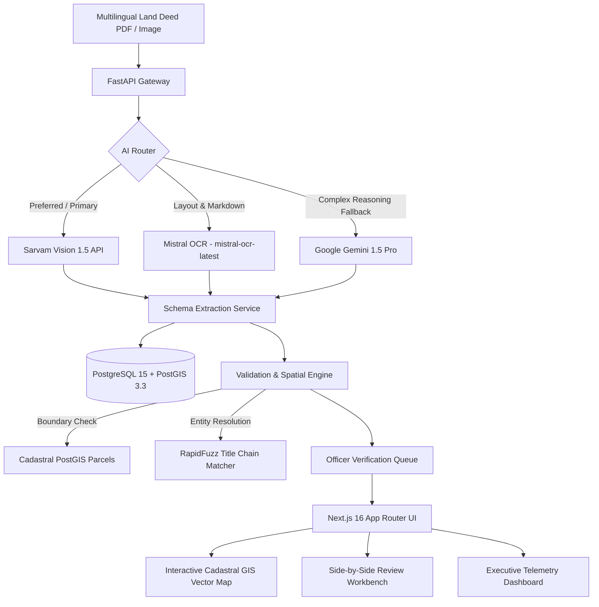

<div align="center">

# 🏛️ Land AI

**Next-Generation Land Record Intelligence, Indic Document AI & Cadastral GIS Verification Platform**

[](https://fastapi.tiangolo.com)
[](https://nextjs.org)
[](https://postgis.net)
[](https://www.sarvam.ai)
[](https://mistral.ai)
[](https://playwright.dev)
[](#testing)

*Empowering transparent, dispute-free Indian land governance through specialized Indic OCR, geodetic cadastral mapping, and automated title verification.*

[3-Minute Pitch Script](docs/PITCH.md) • [Interactive Dashboard](http://localhost:3000/dashboard) • [Cadastral GIS Map](http://localhost:3000/gis) • [Verification Workspace](http://localhost:3000/verification) • [FastAPI Docs](http://localhost:8000/docs)

</div>

---

## 🌟 Executive Overview

In India, over **66% of all civil litigation** is tied to land and property disputes, locking up over **$200 Billion** in stalled infrastructure, delayed housing developments, and contested bank mortgages. 

**Land AI** solves this systemic bottleneck by transforming fragile, unstructured, multilingual historical paper deeds (**7/12 Satbara in Maharashtra, RTC Pahani in Karnataka, and Jamabandi in Punjab/Haryana**) into certified, machine-readable digital land records with automated spatial boundary validation.

### Key Capabilities
- 📑 **Indic Document AI**: High-accuracy OCR extraction of regional revenue forms and Devanagari numerals powered by **Sarvam Vision 1.5** and **Mistral OCR (`mistral-ocr-latest`)**.
- 🔄 **Resilient AI Router**: Automatic failover chain (**Sarvam $\rightarrow$ Mistral $\rightarrow$ Google Gemini 1.5 Pro**) with multi-model High-Accuracy ensemble comparison.
- 🗺️ **Cadastral GIS & PostGIS Verification**: Geodetic polygon area calculation and spatial boundary discrepancy checking ($>5\%$ tolerance).
- 🔍 **Fuzzy Title Chain Reconstruction**: Levenshtein entity matching using RapidFuzz to track succession, mutations, and duplicate title registrations.
- ✍️ **Human-in-the-Loop Active Learning Workbench**: Side-by-side deed inspection with bounding box citations, instant field editing, and active learning diff exports.
- 🛡️ **Enterprise RBAC & Audit Trail**: 6-role statutory access control (Admin, Manager, Land Officer, Verification Officer, GIS Officer, Viewer) with tamper-evident state mutation logging.

---

## 🏗️ Architecture & Technology Stack



### Full-Stack Technologies
| Layer | Technologies |
| :--- | :--- |
| **Frontend Web App** | Next.js 16 (App Router), React 19, TypeScript, Tailwind CSS, Lucide Icons, shadcn/ui |
| **Backend API Service** | Python 3.12, FastAPI, Pydantic v2, SQLAlchemy 2.0, GeoAlchemy2, Uvicorn |
| **Spatial & Cadastral DB** | PostgreSQL 15, PostGIS 3.3, Shapely (Geodetic polygon projection) |
| **AI OCR & Multi-modal** | Sarvam Document AI 1.5, Mistral OCR (`mistral-ocr-latest`), Google Gemini 1.5 Pro |
| **Entity Matching & Queue** | RapidFuzz, Redis 7, Celery Workers, JWT Authentication, bcrypt |
| **Automated Testing** | Pytest (50 unit & integration tests), Playwright (E2E browser testing) |

---

## 🚀 Quickstart: Run Locally in 3 Steps

Follow these simple steps to spin up the complete Land AI monorepo on your local machine:

### Prerequisites
- [Docker & Docker Compose](https://www.docker.com/)
- [Python 3.11+](https://www.python.org/)
- [Node.js 18+ & npm](https://nodejs.org/)

---

### Step 1: Start PostGIS & Redis Containers
```bash
# Start PostgreSQL with PostGIS extension and Redis cache in background
docker-compose up -d
```

---

### Step 2: Start the FastAPI Backend Service
```bash
# Navigate to API directory and activate virtual environment
cd apps/api
python3 -m venv .venv
source .venv/bin/activate

# Install dependencies and start server
pip install -r requirements.txt
uvicorn app.main:app --reload --port 8000
```
> 📍 Backend is live at **`http://localhost:8000`** (Swagger API Docs at **`http://localhost:8000/docs`**).

---

### Step 3: Start the Next.js Frontend Application
```bash
# In a new terminal window, navigate to the web directory
cd apps/web

# Install dependencies and run development server
npm install
npm run dev
```
> 📍 Frontend is live at **`http://localhost:3000`**.

---

## 🧪 Testing

The platform includes comprehensive test suites across the full stack:

```bash
# 1. Run all 50 Backend Integration & Unit Tests (Pytest)
cd apps/api
source .venv/bin/activate
pytest -v

# 2. Run Frontend Playwright End-to-End Test Suite
cd apps/web
npm run build
npx playwright test
```

---

## 🧭 Monorepo Navigation & Routes

| Interface | URL Path | Description |
| :--- | :--- | :--- |
| **Landing & Overview** | `/` | Monorepo architecture and component matrix |
| **Deed Upload & Pipeline** | `/upload` | 1-Click sample deed upload, OCR engine selection, and AI processing |
| **Executive Dashboard** | `/dashboard` | Digitization progress, district KPI metrics, and telemetry |
| **Cadastral GIS Explorer** | `/gis` | Interactive SVG/GeoJSON vector parcel map with area discrepancies |
| **Verification Queue** | `/verification` | Officer queue prioritizing low-confidence and flagged records |
| **Inspection Workbench** | `/verification/[id]` | Side-by-side revenue deed viewer with bounding box citations |
| **Enterprise Audit Trail** | `/audit` | Immutable logs of all deed alterations with RBAC simulation |

---

## 📄 License & Team

Built for the **Smart India Hackathon (SIH)**. Distributed under the MIT License.
